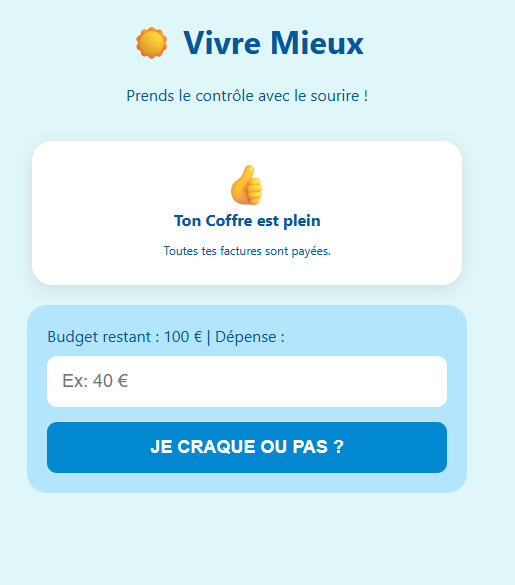

# 🚀 Vivre Mieux - L'Assistant Budgétaire Intelligent

  

---

## 💡 Le Concept
**Reprenez le pouvoir sur votre argent — sans tableur, sans stress.**

**Vivre Mieux** transforme chaque tentation d'achat en décision éclairée. En un clic, confrontez vos envies à vos vrais objectifs (voyage, projet, épargne) et dites adieu aux achats impulsifs.

## ✨ Pourquoi vous allez l'adopter
* 🎯 **Verdict en 1 seconde** — savez tout de suite si vous pouvez vous le permettre.
* 🌴 **Votre rêve sous les yeux** — la photo de votre objectif vous motive à chaque dépense.
* 🔒 **100 % privé** — vos données ne quittent jamais votre téléphone (LocalStorage).
* 💰 **Bons plans malins** — des suggestions pour économiser encore plus (Amazon Partenaires).

## 🛠️ Installation & Utilisation
1. Accédez à l'application : **[bit.ly/vivremieux83](https://bit.ly/vivremieux83)**
2. Pour une meilleure expérience, ajoutez l'application à votre écran d'accueil sur smartphone.

---
*Développé avec passion par Monteiro Nicolas*
